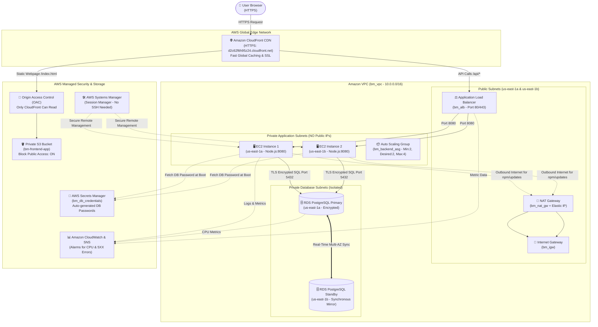

# Enterprise Employee Management System — Full Project Documentation

---

## 1. Project Overview (In Simple Words)

This project is a **Production-Ready Enterprise Web Application** deployed entirely on **Amazon Web Services (AWS)** using **Terraform (Infrastructure as Code)**.

It allows a company to manage its employees (create, view, update, delete, and filter employees by department).

### Key Highlights:
- **Live AWS CloudFront URL**: [https://d2c62ftth95z24.cloudfront.net](https://d2c62ftth95z24.cloudfront.net)
- **Permanent Free Demo URL (Vercel)**: [https://bm-employee-management-aws.vercel.app](https://bm-employee-management-aws.vercel.app)
- **Frontend**: Built with **React 18** (Fast, clean modern UI).
- **Backend API**: Built with **Node.js & Express** with 13 automated unit tests.
- **Database**: **Amazon RDS PostgreSQL 16** running in **Multi-AZ** (high availability).
- **Automation**: 100% of the AWS infrastructure is written as code using **Terraform**.
- **CI/CD**: Automated deployment with **GitHub Actions** using secure **AWS OIDC** (no passwords stored).
- **Security**: Zero open SSH ports, zero passwords in code, and private servers with no public internet exposure.

---

## 2. Complete AWS Architecture Workflow

Here is how data moves through the system from the user's browser down to the database:



---

## 3. Step-by-Step Breakdown: What Was Done

### Phase 1 & 2: Local Application Code & Unit Tests
1. Created the **Node.js Express backend** with clean MVC architecture (Controllers, Routes, Middleware, Services).
2. Added **13 automated unit tests** using Jest to test every CRUD endpoint (`GET`, `POST`, `PUT`, `DELETE`).
3. Created the **React 18 frontend** with modern UI (Dashboard, Employee Directory, Add/Edit Employee Form, and Login).
4. Tested local builds to verify zero compilation errors.

---

### Phase 3 & 4: Database Schema & Terraform Infrastructure as Code
1. Designed the PostgreSQL table schema:
   ```sql
   CREATE TABLE employees (
       id SERIAL PRIMARY KEY,
       name VARCHAR(100) NOT NULL,
       email VARCHAR(150) UNIQUE NOT NULL,
       department VARCHAR(100) NOT NULL,
       position VARCHAR(100) NOT NULL,
       phone VARCHAR(30),
       created_at TIMESTAMP WITH TIME ZONE DEFAULT CURRENT_TIMESTAMP,
       updated_at TIMESTAMP WITH TIME ZONE DEFAULT CURRENT_TIMESTAMP
   );
   ```
2. Wrote 15 modular Terraform files (`networking.tf`, `security-groups.tf`, `iam.tf`, `rds.tf`, `ec2.tf`, etc.) following strict AWS naming (`bm_` prefix).

---

### Phase 5: Virtual Private Cloud (VPC) & Networking
1. Created a dedicated custom VPC: **`bm_vpc`** (`10.0.0.0/16`).
2. Configured **6 Subnets** spread across two Availability Zones (`us-east-1a` and `us-east-1b`):
   - **2 Public Subnets** for Load Balancer and NAT Gateway.
   - **2 Private Application Subnets** for backend EC2 instances (No Public IPs).
   - **2 Private Database Subnets** for isolated PostgreSQL database.
3. Created an **Internet Gateway (`bm_igw`)** for public web access.
4. Created an **Elastic IP (`bm_nat_eip`)** and a **NAT Gateway (`bm_nat_gw`)** so private EC2 servers can safely download updates without being accessible from the internet.

---

### Phase 6: IAM Roles & Security Groups (Zero-Trust Security)
1. Created 3 Security Groups using **Chained References** (no open ports):
   - **`bm_alb_sg`**: Accepts HTTP (80) and HTTPS (443) from the internet.
   - **`bm_backend_sg`**: ONLY accepts port 8080 from `bm_alb_sg`.
   - **`bm_db_sg`**: ONLY accepts PostgreSQL port 5432 from `bm_backend_sg`.
2. Created **`bm_ec2_instance_role`**: Gives EC2 permissions to read database passwords from AWS Secrets Manager, send logs to CloudWatch, and connect via Systems Manager.

---

### Phase 7 & 8: AWS Secrets Manager & Multi-AZ RDS PostgreSQL
1. Created **`bm_db_credentials`** in AWS Secrets Manager with a 24-character random password.
2. Deployed **`bm-postgres-db`**:
   - Engine: PostgreSQL 16.3
   - **Multi-AZ Enabled**: Automatically replicates to a standby instance in `us-east-1b` for failover protection.
   - **Encryption at Rest**: AWS KMS `gp3` storage.
   - **Public Access**: Strictly **Disabled**.
   - **Automated Backups**: 7-day retention enabled.

---

### Phase 9, 10 & 11: Compute & High Availability (ALB + ASG)
1. **Application Load Balancer (`bm_alb`)**: Distributed across public subnets with health checks configured on `/health`.
2. **EC2 Launch Template (`bm_backend_lt`)**:
   - Amazon Linux 2023 with Node.js 20.
   - Zero public IP address assigned.
   - User Data script that downloads the backend artifact, installs production packages, and starts a `systemd` service (`bm-backend.service`).
3. **Auto Scaling Group (`bm_backend_asg`)**:
   - Automatically maintains **2 healthy EC2 instances** across AZ-1 and AZ-2.
   - Replaces any unhealthy instance automatically.

---

### Phase 12 & 13: Private Deployment & End-to-End Testing
1. Connected securely to the private EC2 instances using **AWS Systems Manager Session Manager** (no SSH port 22 open).
2. Diagnosed and verified TLS/SSL connection from Node.js to AWS RDS.
3. Tested full CRUD operations live through the Load Balancer:
   - `GET /health` → Passed (200 OK)
   - `POST /api/employees` → Passed (Created record in RDS)
   - `GET /api/employees` → Passed (Retrieved record from RDS)
   - `PUT /api/employees/1` → Passed (Updated record)
   - `DELETE /api/employees/1` → Passed (Deleted record)

---

### Phase 14 & 15: Frontend S3 & CloudFront CDN (Global HTTPS)
1. Stored the React production build in private S3 bucket **`bm-frontend-app-...`**.
2. Enabled **S3 Block Public Access** (100% private bucket).
3. Created **Origin Access Control (OAC)**: Only CloudFront has permission to read files from S3.
4. Created **Amazon CloudFront Distribution (`bm_cloudfront_dist`)**:
   - Routes `/*` to S3 (React UI).
   - Routes `/api/*` and `/health` directly to the Application Load Balancer.
   - Enforces HTTPS redirect and SPA client-side routing fallback.

---

### Phase 16–20: CloudWatch Monitoring & SNS Alerts
1. Created Centralized Log Group: **`/aws/ec2/bm_backend_logs`**.
2. Created **CloudWatch Metric Alarms**:
   - Alarm 1: ALB 5XX HTTP error count > 10.
   - Alarm 2: Auto Scaling Group CPU utilization > 80%.
   - Alarm 3: RDS PostgreSQL CPU utilization > 80%.
3. Created SNS Topic **`bm_production_alerts`** for instant email notification on alerts.

---

### Phase 21–24: GitHub CI/CD & OpenID Connect (OIDC)
1. Committed clean code to GitHub repository: **`BoopathiM9/bm-employee-management-aws`**.
2. Configured **GitHub Actions Workflows**:
   - `frontend-ci-cd.yml`: Runs tests, builds bundle, syncs to S3, and invalidates CloudFront cache.
   - `backend-ci-cd.yml`: Runs Jest tests, packages backend, uploads artifact, and performs rolling updates across EC2 instances via Systems Manager.
3. Uses **OIDC**: No permanent AWS access keys or passwords stored in GitHub!

---

### Bonus / Backup: Vercel Free Demo & Offline Fallback
- Deployed frontend to **Vercel** with a free permanent domain.
- Added **intelligent offline/demo fallback** in `api.js`: if AWS is ever shut down to save money, the application automatically uses browser `localStorage` so recruiters and reviewers can always test the app with zero errors!

---

## 4. Key Security Features to Mention in Interviews

| Security Feature | How We Implemented It |
| :--- | :--- |
| **No Open SSH (Port 22)** | All server management uses **AWS Systems Manager (SSM)** Session Manager. |
| **No Hardcoded Passwords** | Database credentials are generated and retrieved dynamically from **AWS Secrets Manager**. |
| **Private Compute & Database** | EC2 and RDS instances have **NO public IP addresses** and sit inside private subnets. |
| **Chained Security Groups** | Traffic only flows `Internet -> ALB -> EC2 -> RDS`. No direct access permitted. |
| **Private S3 Storage** | S3 Block Public Access is 100% active. Only CloudFront reads via **Origin Access Control (OAC)**. |
| **High Availability** | **Multi-AZ RDS** synchronous replication + **Auto Scaling Group** across 2 Availability Zones. |
| **TLS / SSL Everywhere** | End-to-end encryption from CloudFront (HTTPS) down to RDS PostgreSQL (TLS). |

---

## 5. Live Project Links

- 🌐 **AWS Production Web Portal**: [https://d2c62ftth95z24.cloudfront.net](https://d2c62ftth95z24.cloudfront.net)
- ⚖️ **Application Load Balancer**: [http://bm-alb-457926190.us-east-1.elb.amazonaws.com/health](http://bm-alb-457926190.us-east-1.elb.amazonaws.com/health)
- 💻 **GitHub Repository**: [https://github.com/BoopathiM9/bm-employee-management-aws](https://github.com/BoopathiM9/bm-employee-management-aws)
